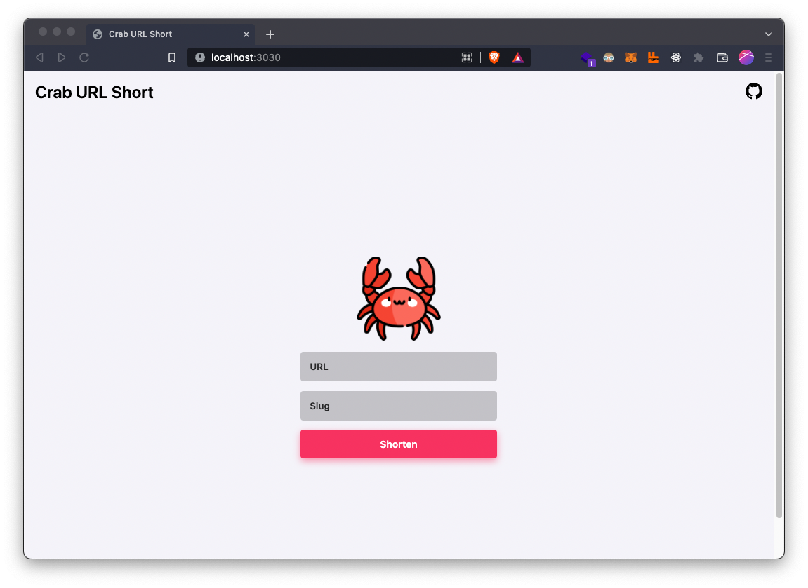

#  🦀 Crab URL Shortener

<div align="center">
  <br>
    
  <br>
</div>

## Build and Run

1. Install [Rust](https://www.rust-lang.org/pt-BR/learn/get-started).
2. Clone this repo.
3. Run this command in project root dir.
```
cargo run
```

